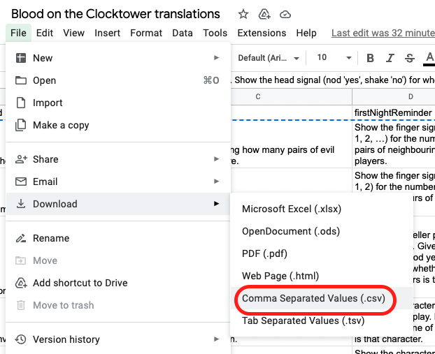

# BotcTranslations

This repo contains scripts to generate JSON files for use on [clocktower.online](https://clocktower.online/) or [Nara](https://nara.fly.dev/). We do it from csv files containing translations of roles' abilities, night reminders and reminder tokens.

You can find already generated JSON files in [assets/generated_json](assets/generated_json).

The language we use is Elixir (see how to [install](https://elixir-lang.org/install.html#macos) it).

## Google Sheet / CSV

We use a google sheet to edit, discuss, and maintain translations of the game, mainly for digital use on [clocktower.online](https://clocktower.online/) or [Nara](https://nara.fly.dev/). This format should also be usable to generate translations for the physical copy of the game one day.

Here, we are most interested in tabs like [JSON Generator EN](https://docs.google.com/spreadsheets/d/1ksIW9R3xkP-RHT4iGDAsKom8LVlPiXIphvDedApumT0/edit#gid=1293348289) and their corresponding tab in other languages. We download them in CSV format for use in our JSON generating script.



## Running the script

Once we have the CSV file for our language, we can run a script that will generate a JSON file in the clocktower.online format.

```bash
mix run generate_json_from_csv.exs assets/csv/<LOCALE>.csv
```

The result will be at `assets/generated_json/roles_<LOCALE>.json`

Try it out with the french file: 
```bash
mix run generate_json_from_csv.exs assets/csv/fr.csv
```

## Using the generated JSON

The generated json files match the format used on clocktower.online. 

You can use them directly as custom scripts (but every role will be available in your game, which is maybe a bit much!) or you can remove the roles you don't want before using them as custom scripts.

We will work on helping you generate ready-made scripts soon (see [Contributions](#contributions))

## Contributions

The best way to help is to add your language to the google sheet (by duplicating [JSON Generator EN](https://docs.google.com/spreadsheets/d/1ksIW9R3xkP-RHT4iGDAsKom8LVlPiXIphvDedApumT0/edit#gid=1293348289)) and then pinging [RealVidy#2485](https://discordapp.com/users/668940363196792849) on Discord.

If you want to help with development, we need a way to generate custom scripts with the translations (which is actually easily done, ask [RealVidy#2485](https://discordapp.com/users/668940363196792849) on Discord!)
