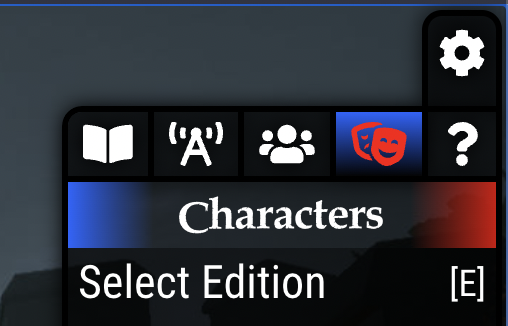
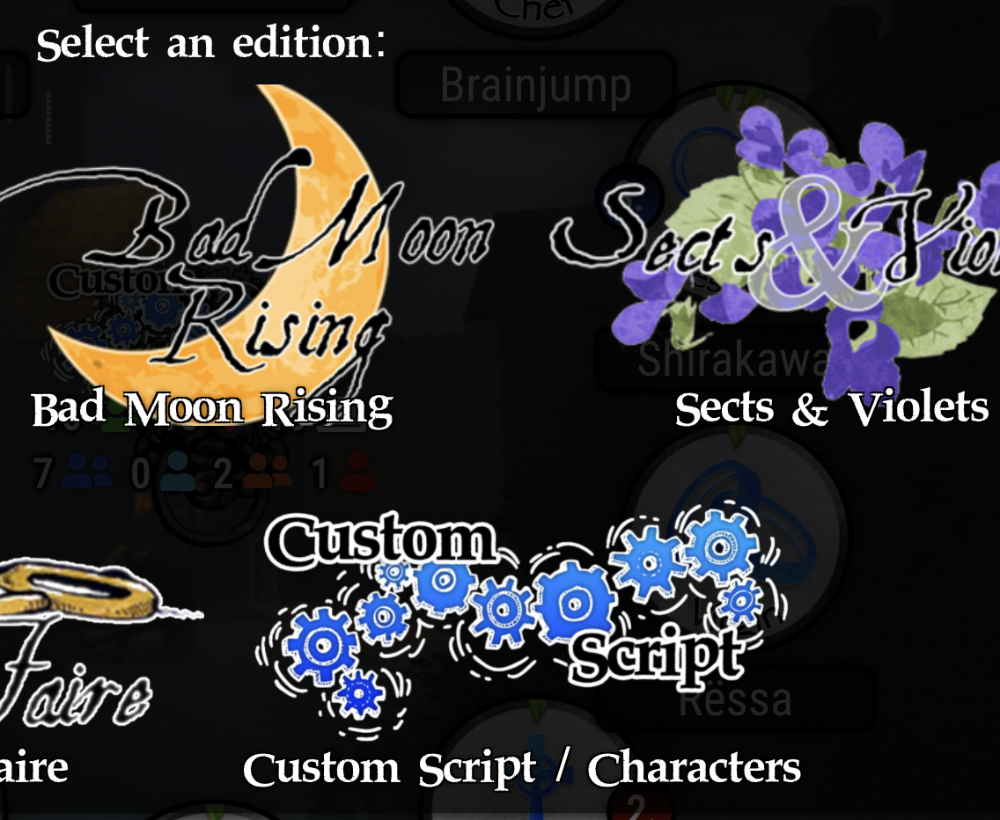
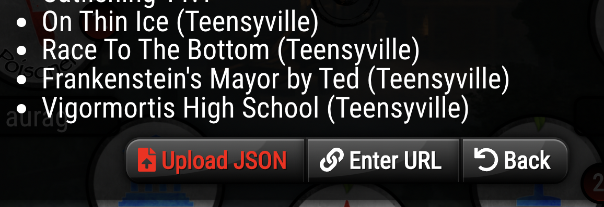

# How to use

- Open your locale's folder (`fr_FR` for French, `es_ES` for Spanish...)
- Choose a script you want to play and download it RAW (there is a limited selection but if you want more, let me know. I'm [RealVidy#2485](https://discordapp.com/users/668940363196792849) on Discord)
- Go to [clocktower.online](https://clocktower.online)
- Open the `Characters > Select Edition` (or press "E") 
- Select `Custom Script` 
- Click on `Upload JSON` 
- Select the JSON you downloaded
